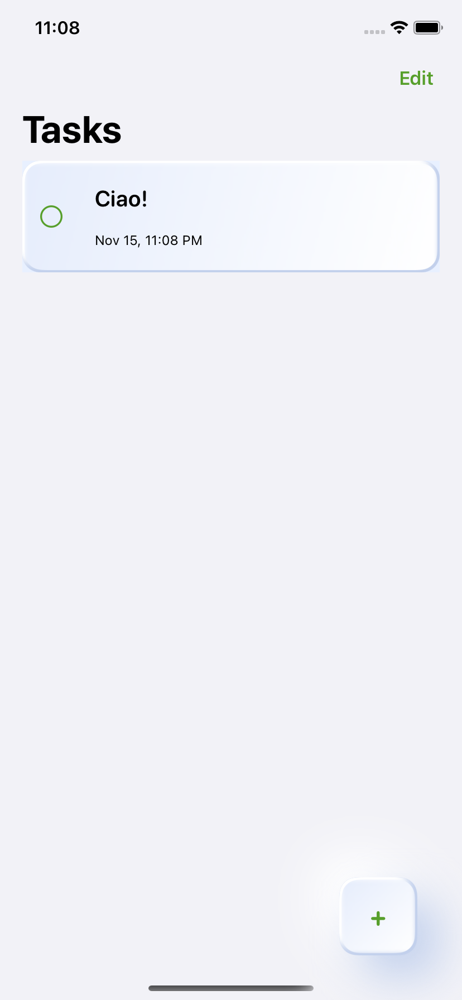

# Tasks
>  iOS App using SwiftUI and CoreData and Neuromorphic design

>  Stay on Top of Your To-Dos with Neuromorphic Design!



## Features

- [x] Neuromorphic design 
- [x] Store permanently all your daily tasks and delete them when you're done

#### 🔨 Technologies: SwiftUI, CoreData, No Third Party libraries.
####  🚀Platform: 📱iOS

## Includes

- [x] Neuromorphic design on reusable AddButton.
- [x] Custom modifiers to speed up your layout creation.
- [x] Handling reactively the keyboard
- [x] Modal presentation to add new tasks

## Requirements

- iOS 13.0+
- Xcode 11.0+

## Getting Started

1. Clone the repository:
```bash
git clone https://github.com/your-username/Tasks.git
```

2. Open the project in Xcode.

3. Build and run the app.

## Thanks for stopping by!
